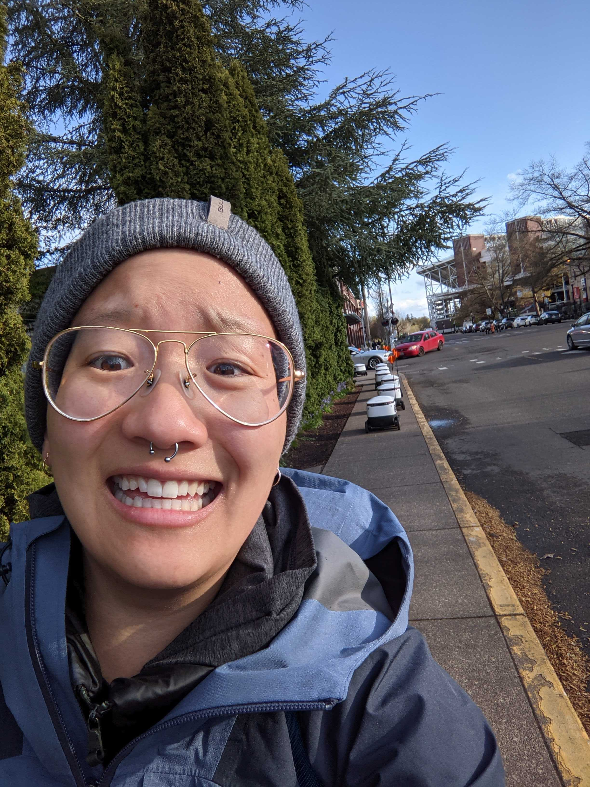

## James R. Watson

__Associate Professor__ 
College of Earth, Ocean and Atmospheric Sciences 
Oregon State University, USA 
_email:_ james.watson@oregonstate.edu 
[Google Scholar](https://scholar.google.se/citations?user=LHQ0BPkAAAAJ&hl=en) 

__CEO and Co-Founder__ 
The Prediction Lab LLC. 
A think and do tank that solves hard problems using tools from mathematics and computer science. Visit our [Website](https://thepredictionlab.com/) 

__Education and Professional Appointments__ 
BSc Biochemistry, University of Bristol, UK, 1998-2001 
MSc Oceanography, National Oceanography Centre, UK, 2003-2005 
PhD Marine Science, University of California Santa Barbara, USA, 2006-2011 
Post-doc Scholar, Atmospheric And Ocean Sciences program (AOS), Princeton University, USA, 2011-2013 
Post-doc Research Associate, Dept. Ecology and Evolutionary Biology, Princeton University, USA, 2014 
Forskare, Stockholm Resilience Centre, Sweden, 2014-2017 
Assistant Professor, Oregon State University, OR, USA, 2017-2022 
Associate Professor, Oregon State University, OR, USA, 2022-present 

## Post-docs

2018 -- **A. John Woodill**, College of Earth, Ocean and Atmospheric Sciences, Oregon State University. 
John has expertise in resource economics, data science, climate adaptation, harmful algal blooms, predicting and measuring the impacts of illegal fishing.
 
 
 

## PhD Students

2020 -- **Keiko Nomura**, PhD student in Geography, Oregon State University. 
Keiko researches (outer) space, sports and the sea through the lens of Complex Adaptive Systems theory.
 
 
 

 

2020 -- **Val Chang**, PhD student in the Geography Program, Oregon State University.  
Val researches the entanglement between the physical and social dimensions of climate change. Their current project uses satellite remote-sensing and environmental soundscapes to understand the way climate change impacts our relationships to place. Val is an interdisciplinary artist creating video-based projection art installations about their work transforming science into action and building emotional resonance in climate change research.
 
 
 

## Junior Researchers

2019 -- **Mihir Joshi**, High school student, Salem.  
Mihir is interested in the impact of climate change on shifting species range distributions. Specifically, Mihir focuses on marine organisms and the role that marine protected areas will play in buffering the impacts of climate change.

## Former Lab Members
__Anne Devan Song__, 2018-2022, PhD, College of Earth, Ocean and Atmospheric Sciences, Oregon State University. 
__Ciera Villegas__, 2017-2022, PhD, College of Earth, Ocean and Atmospheric Sciences, Oregon State University. 
__Steven Johnson__, 2017-2022, PhD, College of Earth, Ocean and Atmospheric Sciences, Oregon State University. 
__George Hagstrom__, 2020, Post-doc, College of Earth, Ocean and Atmospheric Sciences, Oregon State University. 
__Srikar Valluri__, 2020, BS, Computer Science, Oregon State University. 
__Ginny Katz__, 2018-2022, PhD, College of Earth, Ocean and Atmospheric Sciences, Oregon State University. 
__Nicolás Gómez-Andúja__, 2019-2021, MS, College of Earth, Ocean and Atmospheric Sciences, Oregon State University. 
__Shannon Hennessey__, 2020-2021, Post-doc, College of Earth, Ocean and Atmospheric Sciences, Oregon State University. 
__Ernesto Villarino__, 2018-2021, Post-doc, College of Earth, Ocean and Atmospheric Sciences, Oregon State University. 
__Mathew Titus__, 2017-2020, Post-doc, College of Earth, Ocean and Atmospheric Sciences, Oregon State University. 
__Alison Iles__, 2019, Post-doc, College of Earth, Ocean and Atmospheric Sciences, Oregon State University. 
__Zach Gelbaum__, 2017-2019, Post-doc, College of Earth, Ocean and Atmospheric Sciences, Oregon State University. 
__Emily Klein__; 2014-2016, Post-doc, Stockholm Resilience Centre / Princeton University exchange program 
__Matthieu Barbier__; 2014-2016, Post-doc, Stockholm Resilience Centre / Princeton University exchange program 
__Laura Elsler__; 2014, MS student, Sustainable Development-Environmental Sciences, University of Graz 
__Roweena Patel__; 2013, MS student, Sustainability Science, Stockholm Resilience Centre 
__Angela Zhou__; 2013, BS student, Stockholm Resilience Centre research intern from Princeton University 
__Jen Zhao__; 2013, BS student, Stockholm Resilience Centre research intern from Princeton University 
__Alex Ahn__; 2011-2012, BS student, Stockholm Resilience Centre research intern from Swarthmore College 
