## James R. Watson
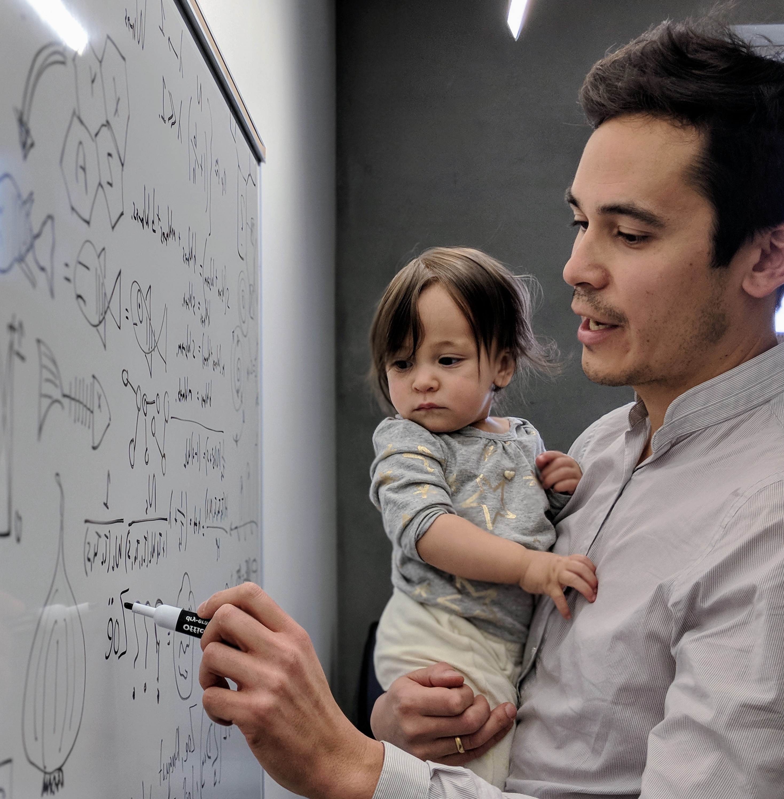
__Assistant Professor__ 
College of Earth, Ocean and Atmospheric Sciences 
Oregon State University, USA 
_email:_ jrwatson@coas.oregonstate.edu 
[Google Scholar](https://scholar.google.se/citations?user=LHQ0BPkAAAAJ&hl=en) 
[CV](http://watsonjr.github.io/people/Watson_CV.pdf) 

__CEO and Co-Founder__ 
The Prediction Lab LLC. 
A think and do tank that solves hard problems using tools from mathematics and computer science. Visit our [Website](https://thepredictionlab.com/) 
We make cool products like:
[A harmful algal bloom prediction system](https://detroitlake.thepredictionlab.com/home) 

__Education and Professional Appointments__ 
BSc Biochemistry, University of Bristol, UK, 1998-2001 
MSc Oceanography, National Oceanography Centre, UK, 2003-2005 
PhD Marine Science, University of California Santa Barbara, USA, 2006-2011 
Post-doc Scholar, Atmospheric And Ocean Sciences program (AOS), Princeton University, USA, 2011-2013 
Post-doc Research Associate, Dept. Ecology and Evolutionary Biology, Princeton University, USA, 2014 
Forskare / Research Assistant Professor, Stockholm Resilience Centre, Sweden, 2014-2017 
Assistant Professor, Oregon State University, OR, USA, 2017-present 

## Post-docs
<!--2020 -- **George Hagstrom**, College of Earth, Ocean and Atmospheric Sciences, Oregon State University and Princeton University. -->

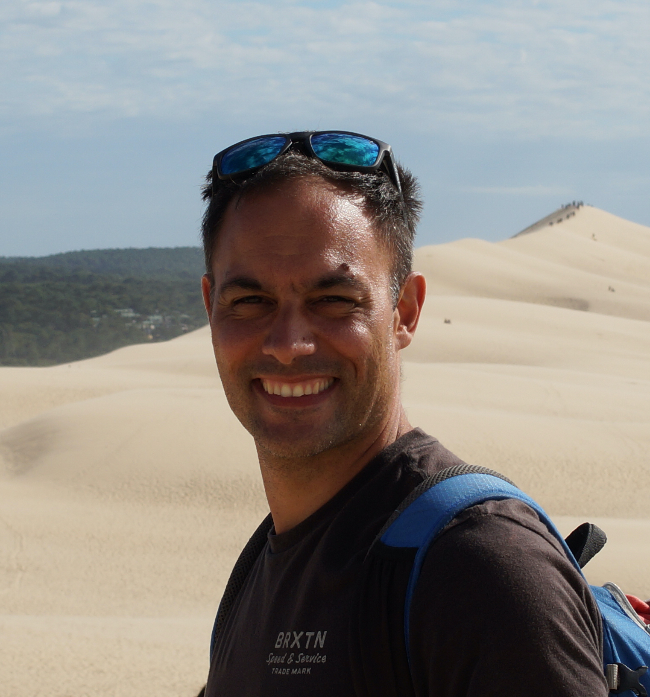
2019 -- **Ernesto Villarino**, AZTI Tecnalia, Spain. 
Ernesto studyies climate change impacts on the spatial distribution of marine biodiversity and ecosystem functions. Marine population connectivity. Marine micro-plastics.
 
 
 

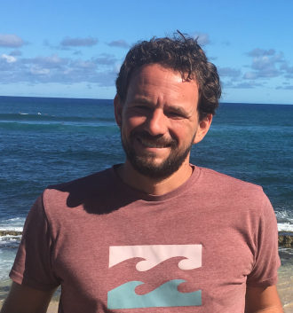
2020 -- **A. John Woodill**, College of Earth, Ocean and Atmospheric Sciences, Oregon State University. 
John has expertise in resource economics, data science, climate adaptation, harmful algal blooms, predicting and measuring the impacts of illegal fishing.
 
 
 

## PhD Students
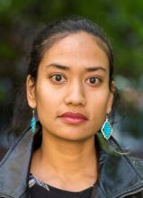
2019 -- **Anne Devan-Song**, PhD student in Integrative Biology, Oregon State University. 
Anne is a field biologist from Singapore, who studies wildlife and human-wildlife networks and their implications for a wide variety of disease and conservation problems. Her website is [here](https://devansong.weebly.com/).
 
 
 

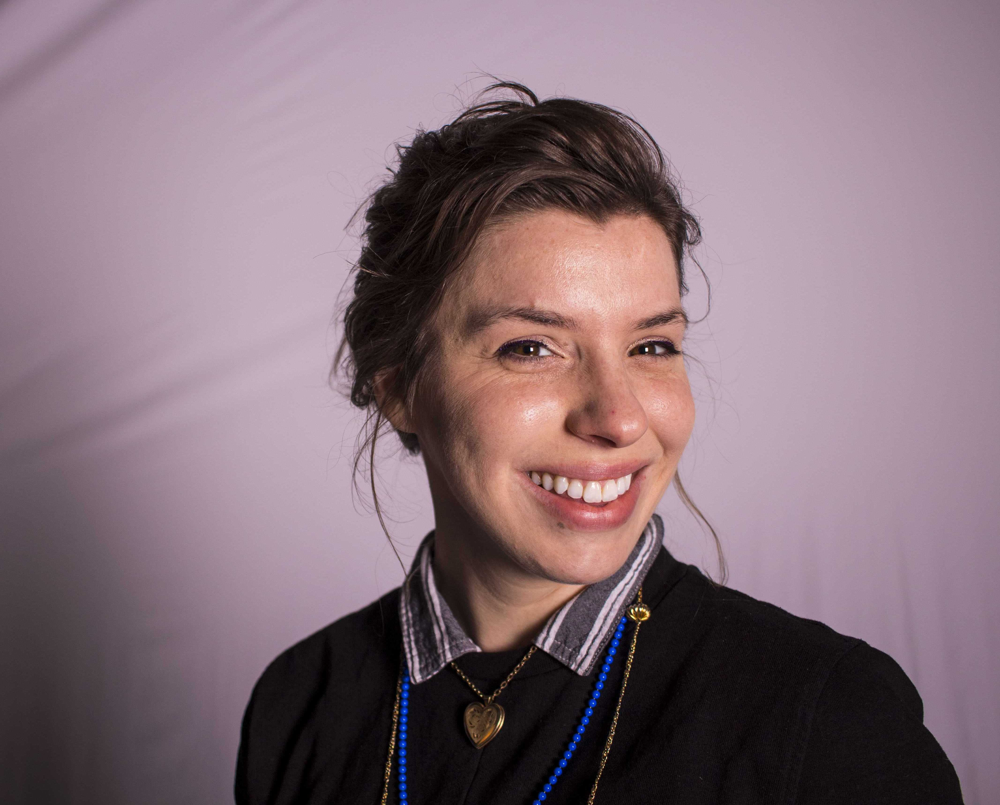
2019 -- **Ginny Katz**, PhD student in Geography, Oregon State University.   
Ginny focuses on tools that help communities and systems adapt to disasters. Her research explores problems in the communication nexus between communities, institutions, and current technology. She comes to the lab with a BS Public Health, Epidemiology & Disease Control and Master of Global Health with expertise in disaster management. Ginny founded local tech startup HazAdapt, INC. that builds Inclusive Technology for community emergency communication. More recently, she started serving as Chief Operations Officer for the PNW nonprofit, COVID Response Collective. 
 
 
 

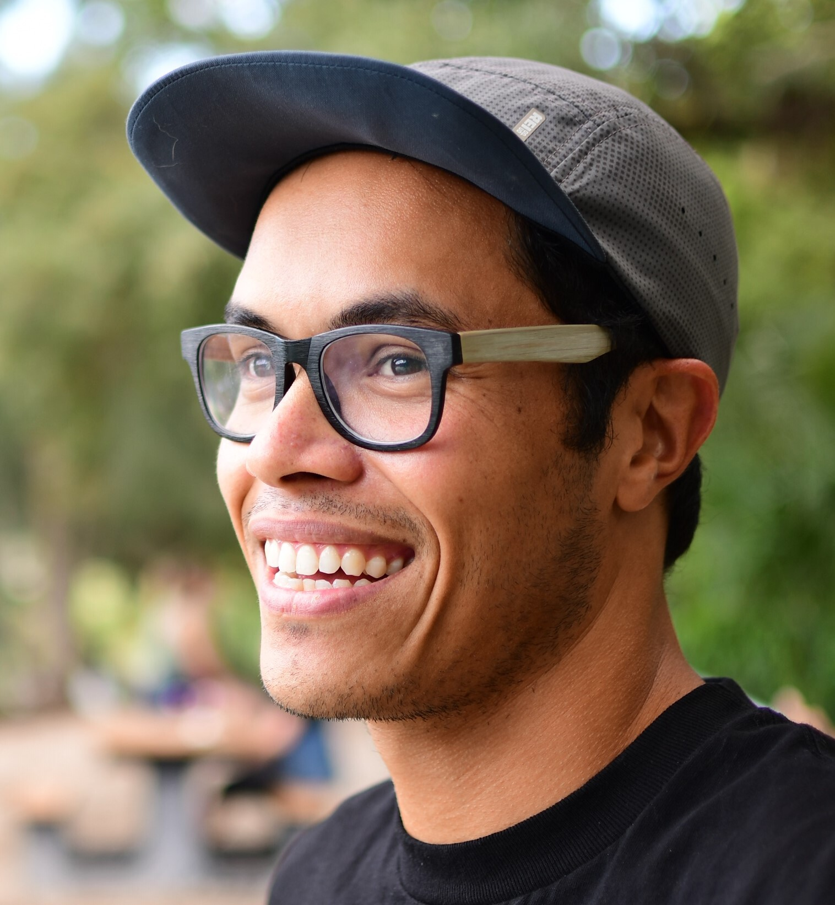
2017 -- **Steven Johnson**, PhD student in the College of Earth, Ocean and Atmospheric Sciences, Oregon State University. 
Steven is from the island of Saipan and has Pacific Island and Jamaican heritage. His research is rooted in his deep connection for the ocean and the people who depend on it's health - each and every one of us on this planet. He uses quantitative approaches to understand marine socio-environmental system dynamics
 
 
 

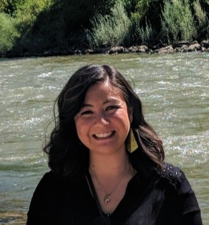
2017 -- **Ciera Villegas**, PhD student in the Environmental Sciences Graduate Program, Oregon State University.  
Ciera is a McNair Scholar and a native San Diegan with Mexican, Japanese, Spanish, British and Irish ancestry. Her research primarily focuses on contemporary conflict and cooperation over fisheries resources in Puerto Rico. She utilizes a mixed-methods approach incorporating the analyses of news reports and semi-structured interviews to understand the complex social-ecological system dynamics over fisheries resources in the context of drivers
 
 
 

## Masters Students
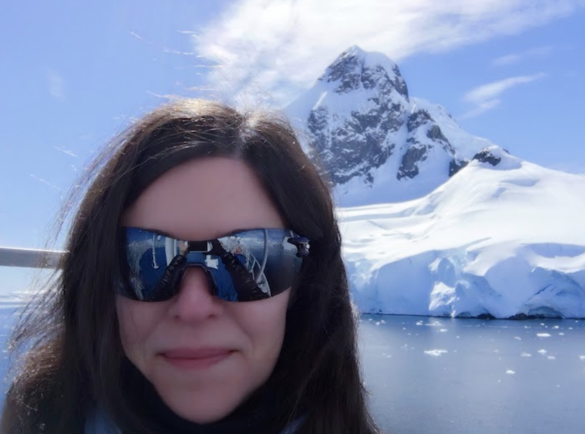
2019 -- **Helena Edelson**, MS student in the Environmental Sciences Graduate Program, Oregon State University. 
Helena is researching sustainable, scalable solutions for conservation of snow leopards and other endangered species, involving climate change, human-wildlife coexistence, poaching and illegal trade. She combines Complex Adaptive Systems, game theory, aerial robotics, drones and satellite imagery to form richer data sets, increase accuracy and understanding, and overcome resource limitations on the ground. Helena has given international conference talks and keynotes on technology and complex adaptive systems. She comes to the lab with years of expertise in engineering massive scalable data for AI, machine learning and real-time analytics, from her long career as a principal software engineer in Silicon Valley. More about her work and research on her [website.](http://complex-human.com/) 
 
 

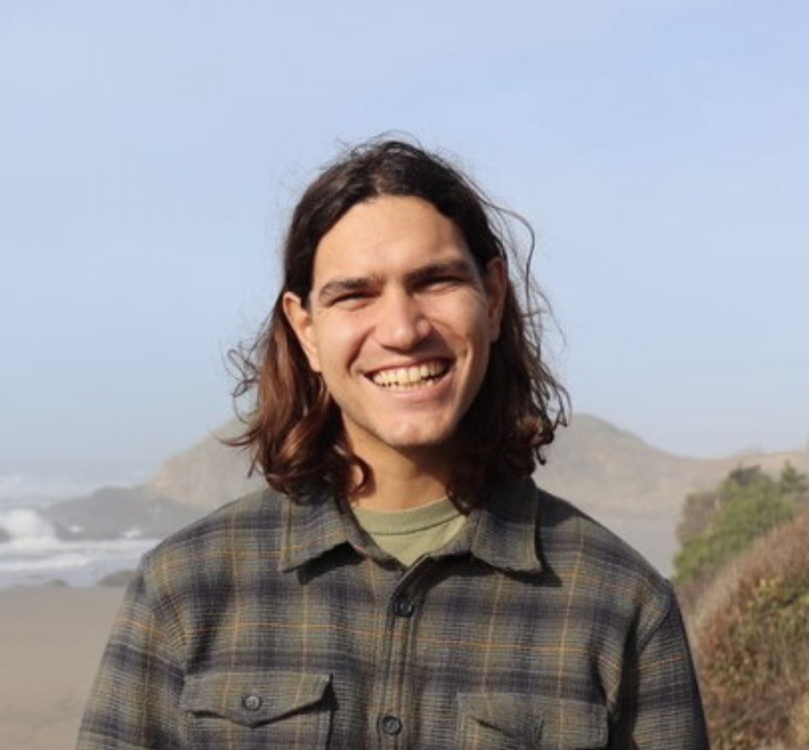
2019 -- **Nicolás Gómez-Andújar**, MS student in the Marine Resource Management Program, Oregon State University. 
Nico researches the adaptive governance of coastal socio-ecological systems. He focuses on cooperative and non-cooperative behaviors of small-scale fishers in Puerto Rico and the role of social-networks and informal arrangements for coping with ecosystem change and social instability.  
Nico researches the adaptive governance of coastal socio-ecological systems. He focuses on cooperative and non-cooperative behaviors of small-scale fishers in Puerto Rico and the role of social-networks and informal arrangements for coping with ecosystem change and social instability.  
 

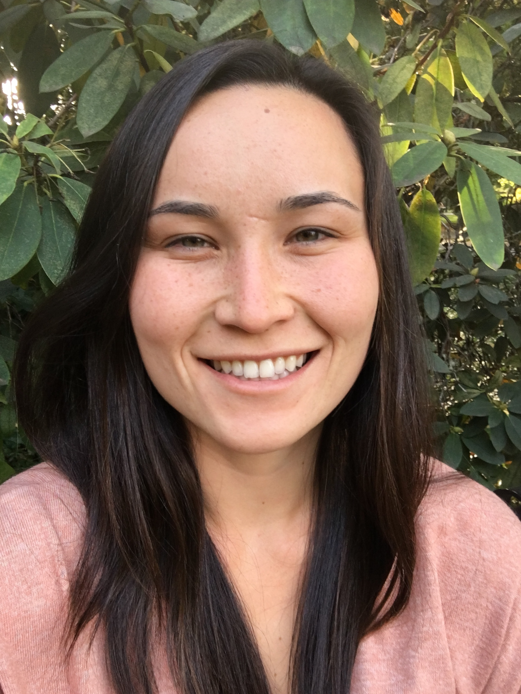
2020 -- **Keiko Nomura**, MS student in the Marine Resource Management Program, Oregon State University. 
Keiko researches the adaptive capacity of marine social-ecological systems. Her current project uses network analysis to quantify the adaptive capacity of small-scale fishermen in Baja, Mexico.
 
 
 

## Junior Researchers
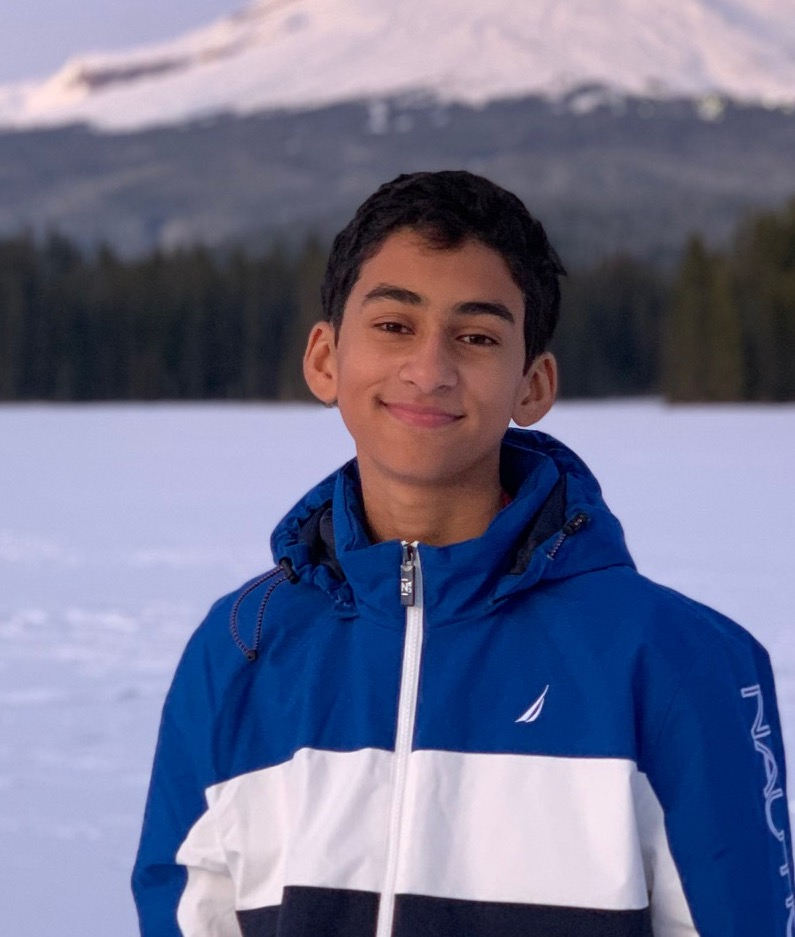
2019 -- **Mihir Joshi**, Middle school student, Howard Street Charter School, Salem.  
Mihir is interested in the impact of climate change on shifting species range distributions. Specifically, Mihir focuses on marine organisms and the role that marine protected areas will play in buffering the impacts of climate change.

## Former Lab Members
__Mathew Titus__, 2017-2020, Post-doc, College of Earth, Ocean and Atmospheric Sciences, Oregon State University. 
__Alison Iles__, 2019, Post-doc, College of Earth, Ocean and Atmospheric Sciences, Oregon State University. 
__Zach Gelbaum__, 2017-2019, Post-doc, College of Earth, Ocean and Atmospheric Sciences, Oregon State University. 
__Emily Klein__; 2014-2016, Post-doc, Stockholm Resilience Centre / Princeton University exchange program 
__Matthieu Barbier__; 2014-2016, Post-doc, Stockholm Resilience Centre / Princeton University exchange program 
__Andrew Tilman__; 2013-2016, PhD student, Stockholm Resilience Centre / Princeton University exchange program 
__Lisa McManus__; 2012-2016, PhD student, Stockholm Resilience Centre / Princeton University exchange program 
__Laura Elsler__; 2014, MS student, Sustainable Development-Environmental Sciences, University of Graz 
__Roweena Patel__; 2013, MS student, Sustainability Science, Stockholm Resilience Centre 
__Angela Zhou__; 2013, BS student, Stockholm Resilience Centre research intern from Princeton University 
__Jen Zhao__; 2013, BS student, Stockholm Resilience Centre research intern from Princeton University 
__Alex Ahn__; 2011-2012, BS student, Stockholm Resilience Centre research intern from Swarthmore College 
