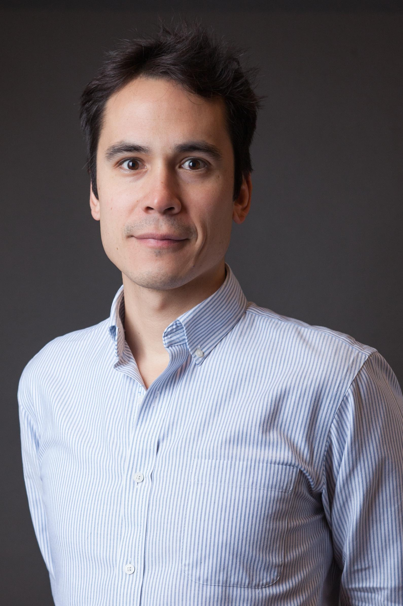

## PI -- James Watson

__Assistant Professor__ 
College of Earth, Ocean and Atmospheric Sciences 
Oregon State University, USA 
_email:_ jrwatson@coas.oregonstate.edu 
[Google Scholar](https://scholar.google.se/citations?user=LHQ0BPkAAAAJ&hl=en) 
[CV](http://watsonjr.github.io/people/Watson_CV.pdf) 

BSc Biochemistry, University of Bristol, UK, 1998-2001 
MSc Oceanography, National Oceanography Centre, UK, 2003-2005 
PhD Marine Science, University of California Santa Barbara, USA, 2006-2011 
Post-doc, Dept. Ecology and Evolutionary Biology, Princeton University, USA, 2011-2014 
Research Scientist, Stockholm Resilience Centre, Sweden, 2014-2017 

## Post-docs
We are currently looking for post-docs to join our group.

## Students
2017 -- Steven Johnson, College of Earth, Ocean and Atmospheric Sciences, Oregon State University.

## Alumni
__Laura Elsler__ 
Laura completed her Masters research project, from the University of Graz, with us in 2015. 

__Roweena Patel__ 
Roweena completed her Masters research project, from the Stockholm University, with us in 2015. 

__Angela Zhou__ 
Angela worked with us as an undergraduate summer intern in 2014 when she was at Princeton University  

__Jen Zhao__ 
Jenn worked with us as an undergraduate summer intern in 2014 when she was at Princeton University  

__Alex Ahn__ 
Alex worked with us as an undergraduate summer intern in 2013 and 2014 while he was at Swarthmore College  

