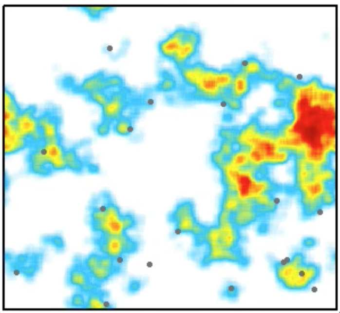

We are involved in a number of research projects spanning marine ecology, resource  economics, sustainability science and complex adaptive systems science. Below you will find an       abbrieviated list of projects I am presently working on:

### Fish, Fishing and Human behavior

I am part of a National Science Foundation funded project - a Dynamics of Coupled Natural-Human      Systems grant - to look at how human behavior is shaped by the environment in which we work. We      include colleagues at Princeton University - [Prof. Simon Levin](http://www.princeton.edu/~slevin/   ) - and a number of students), the University of Hawaii at Manoa - [Dr. John Lynham](http://www2.    hawaii.edu/~lynham/Welcome.html) - and NOAA - [Dr. Jameal Samhouri](http://jamealsamhouri.weebly.com/). We are developing novel mathematical theory and agent-based simulations, and analyzing a novel    dataset on the spatial dynamics of U.S. westcoast fishers.

### Global Marine Ecosystem Modeling
I am working with Earth-System Modelers to develop global marine ecosystem models that resolve       things bigger than zooplankton (not obvious, but this is rare). Specifically, I work with [Dr.       Charles Stock](http://www.gfdl.noaa.gov/charles-stock-homepage) at the [Geophysical Fluids Dynamics  Lab](http://www.gfdl.noaa.gov/) on a simple size-based ecosytem model. The goal is to use this model to estimate how pelagic marine ecosystem might respond to various future climate change and fishing  scenarios.

### Migration Ecology

I have an interest in movement ecology, and I have done some work on baleen whale migration. I have  used output from an Earth System Model, together with information gained from the literature, to     estimate the calving and feeding habitats for baleen whales. I have then thrown network theory into  the mix to identify the shortest oceanographic paths connecting these habitats. This approach        identifies likely baleen whale migration routes, and can be used to develop high-seas conservation   priorities.

### Regional Marine Connectivity

I have worked for some time on marine population connectivity - most nearshore marine species spawn  tiny larvae, that drift primarily with ocean currents. Where they go, and end up growing into adults is of great importance to developing effective spatial marine management, like marine protected      areas. I have worked on this topic from the modeling side - using simulations of larval dispersal,   in realistic metapopulation models to indentify important regions. This work is continuing but in    the Coral Triangle. More to come.

### Global Marine Connectivity

I also work on connectivity but at global scales. Here, we are asking questions of phytoplankton     connectivity time scales - how long does it take for phytoplankton genotypes to travel from say the  Indian Ocean to the Arctic? Similarly to the regional work, we simiulate the dispersal of            phytoplankton and use some nifty network theory to come up with interesting connectivity statistics. This work is being done with [Dr. Bror Jonsson](https://github.com/brorfred)

### Coupled Earth-Human System modeling

This is very much a work in progress, but together with a number of people at the Stockholm          Resilience Centre, we are designing coupled Earth-Human System Models. These explicitly account for  the feedbacks between the earth and human systems, and the goal is to improve the projections of the impact of climate change on the planet. The schematic on the right isn't meant to be read, rather    just give an idea for the road-maps we've been making.

