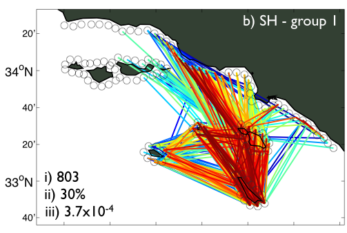
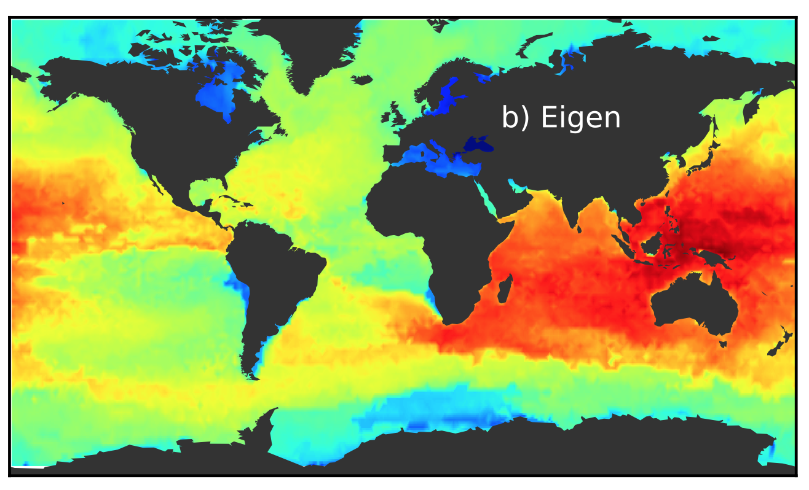

We are involved in a number of research projects spanning marine ecology, resource  economics, sustainability science and complex adaptive systems science. Below you will find an abbrieviated list of projects we are presently working on:

### Cooperative Behavior in Social-ecological Systems

As part of a National Science Foundation funded project - a Dynamics of Coupled Natural-Human      Systems grant - we are looking at how cooperative behavior in fishermen is shaped by the environment in which they work. We work with collaborators at Princeton University - [Prof. Simon Levin](http://www.princeton.edu/~slevin/) - and a number of students), the University of Hawaii at Manoa - [Dr. John Lynham](http://www2.hawaii.edu/~lynham/Welcome.html) - and NOAA - [Dr. Jameal Samhouri](http://jamealsamhouri.weebly.com/). We are developing novel mathematical theory and agent-based simulations, and analyzing a novel dataset on the spatial dynamics of U.S. westcoast fishers. In particular, we are advancing the idea of **Fisheries Connectivity**, that is when fishermen work in multiple fisheries (one way in which they deal with income risk), they act to connect these fisheries. Figuring out how to quantify fisheries connectivity, seeing what it looks like for various places and at various scales, and designing management policies that account for it, we see as important steps towards advancing Ecosystem-based fisheries Management.

### Cross-scale Properties of Complex Adaptive Systems
In many important problems, ranging from ecology to geopolitics to finance, interactions and behaviors are known at the microscopic/individual level, but the closures required to translate them to a high-level macroscopic description are unknown. Severe limitations arise in trying either to find these closures directly, or to solve these problems at the scale at which the questions of interest are asked using microscopic simulations only (i.e. using agent-based models). These limitations constitute a major stumbling block in current complex social-like system modeling. Funded by **DARPA**, we are developing new modeling tools, for example manifold learning data-mining tools and Equation Free Modeling, to overcome this challenge. We are using these tools to compare Early Warning Signals of critical transitions in financial markets, social-ecological systems, and human-migration systems. 

### Risk Management in Marine Social-Ecological Systems
We are interested in thinking outside the box in terms of what tools can be used for developing sustainable marine social-ecological systems. In particular we are designing new financial tools that incentivize best management practices by both fishers and aquaculturalists. These include new insurance policies and forwards/futures contracts.

### Global Marine Ecosystem Modeling
Working with Earth-System Modelers at the [Geophysical Fluids Dynamics  Lab](http://www.gfdl.noaa.gov/), specifically [Dr.Charles Stock](http://www.gfdl.noaa.gov/charles-stock-homepage), we develop and run global marine ecosystem models that resolve things bigger than zooplankton (not obvious, but this is rare). We use simple size-based / allometric relationships as the backbone of our ecosytem models. The goal is to use these global models to estimate how pelagic marine ecosystem might respond to future climate change and different fishing scenarios.

### Regional Marine Connectivity

We research marine population connectivity - most nearshore marine species spawn  tiny larvae, that drift primarily with ocean currents. Where they go, and end up growing into adults is of great importance to developing effective spatial marine management, like **marine protected areas**. We are working on this topic from the modeling side - using simulations of larval dispersal in realistic and idealized metapopulation/community models to indentify important subpopulations. This work is continuing in the Coral Triangle. 

### Global Marine Connectivity

We also work on connectivity at global scales. Here, we are quantifying the routes and timescales overwhich planktonic communities are connected. This work combines Lagrangian particle simulations and NOAA drifter data with network theory. Results highlight where in the global ocean heat-tolerant planktonic organisms originate, and where they go. This is vital to understanding how the planktonic biota of the global ocean will change in a warming world. This work is being done with [Dr. Bror Jonsson](https://github.com/brorfred).

### Firms and Cross-sector Management
Firms / companies are key actors in social-ecological systems. Yet, their motives and actions are poorly understood and rarely included in models of these systems. Here, we are developing novel models of firm dynamics in social-ecological systems. We borrow tools from eco-evo models, assuming that firms/companies are defined by "traits", such as running and fixed costs, and that they are also strategic, changing what they do (e.g. how much fish they harvest) in response to each other. Firms also sell their goods, and we are exploring the role international markets play in social-ecological systems. We are also exploring the trade-offs between sectors, such as aquaculture and harvest fisheries, and how they can be managed. These are our efforts to solidify the concept of "Blue Growth".

