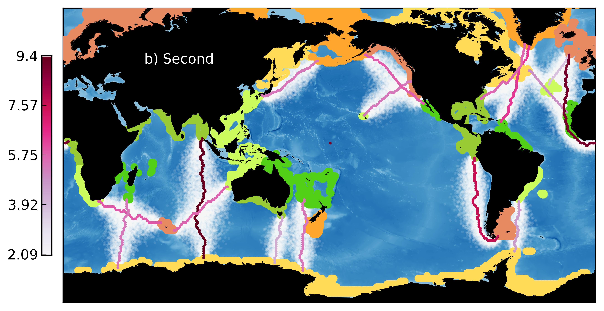

We are involved in a number of research projects spanning marine ecology, resource  economics, sustainability science and complex adaptive systems science. Below you will find an       abbrieviated list of projects we are presently working on:

### Cooperative Behavior in Social-ecological Systems

As part of a National Science Foundation funded project - a Dynamics of Coupled Natural-Human      Systems grant - we are looking at how cooperative behavior in fishermen is shaped by the environment in which they work. We work with collaborators at Princeton University - [Prof. Simon Levin](http://www.princeton.edu/~slevin/) - and a number of students), the University of Hawaii at Manoa - [Dr. John Lynham](http://www2.hawaii.edu/~lynham/Welcome.html) - and NOAA - [Dr. Jameal Samhouri](http://jamealsamhouri.weebly.com/). We are developing novel mathematical theory and agent-based simulations, and analyzing a novel dataset on the spatial dynamics of U.S. westcoast fishers.

### Global Marine Ecosystem Modeling
Working with Earth-System Modelers at the [Geophysical Fluids Dynamics  Lab](http://www.gfdl.noaa.gov/), specifically [Dr.Charles Stock](http://www.gfdl.noaa.gov/charles-stock-homepage), we develop and run global marine ecosystem models that resolve things bigger than zooplankton (not obvious, but this is rare). We use simple size-based / allometric relationships as the backbone of our ecosytem model. The goal is to use these global models to estimate how pelagic marine ecosystem might respond to climate change and different fishing scenarios.

### Regional Marine Connectivity

We research marine population connectivity - most nearshore marine species spawn  tiny larvae, that drift primarily with ocean currents. Where they go, and end up growing into adults is of great importance to developing effective spatial marine management, like marine protected areas. We are working on this topic from the modeling side - using simulations of larval dispersal in realistic metapopulation models to indentify important regions. This work is continuing in the Coral Triangle. 

### Global Marine Connectivity

We also work on connectivity at global scales. Here, we are quantifying the routes and timescales overwhich planktonic communities are connected. This work combines Lagrangian particle simulations with network theory. Results highlight where in the global ocean heat-tolerant planktonic organisms originate, and where they go. This is vital to understanding how the biota of the global ocean will change in a warming world. This work is being done with [Dr. Bror Jonsson](https://github.com/brorfred).

### Firms, Futures and Cross-sector Management
Firms / companies are key actors in social-ecological systems. Yet, their motives and actions are poorly understood and rarely included in models of these systems. Here, we are developing novel models of firm dynamics in social-ecological systems. We borrow tools from eco-evo models, assuming that firms/companies are defined by "traits", such as running and fixed costs, and that they are also strategic, changing what they do (e.g. how much fish they harvest) in response to each other. Firms also sell their goods, and we are exploring what role international markets play in social-ecological systems. We are also exploring the trade-offs between sectors, such as aquaculture and harvest fisheries, and how they can be managed. These our efforts to solidify the concept of "Blue Growth".

### Migration Ecology

We have an interest in movement ecology, having done research on baleen whale migration. Specifically, we have used output from an Earth System Model, together with information gained from the literature, to estimate the calving and feeding habitats for baleen whales. We have then thrown network theory into the mix to identify the shortest oceanographic paths connecting these habitats. This approach identifies likely baleen whale migration routes, and can be used to develop high-seas conservation priorities. Future work in this area will apply migration theory to global datasets, to explore how oceanic migration routes are formed and maintained. 

